<!-- README.md is generated from README.Rmd. Please edit that file -->

# listmap

<!-- badges: start -->
<!-- badges: end -->

The goal of listmap is to get thelist imagery.

## Installation

You can install …

## Example

This is a basic example which shows you how to solve a common problem:

``` r
library(listmap)
library(raster)
#> Loading required package: sp
for (ilayer in 3:14) {
  plotRGB(listmap(layer = ilayer))
}
```

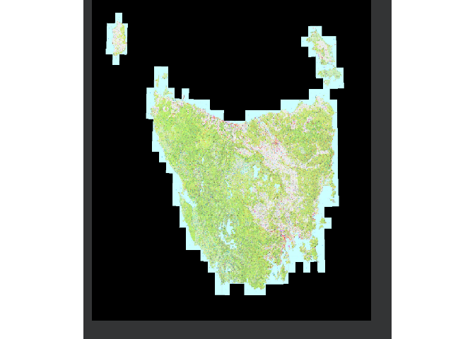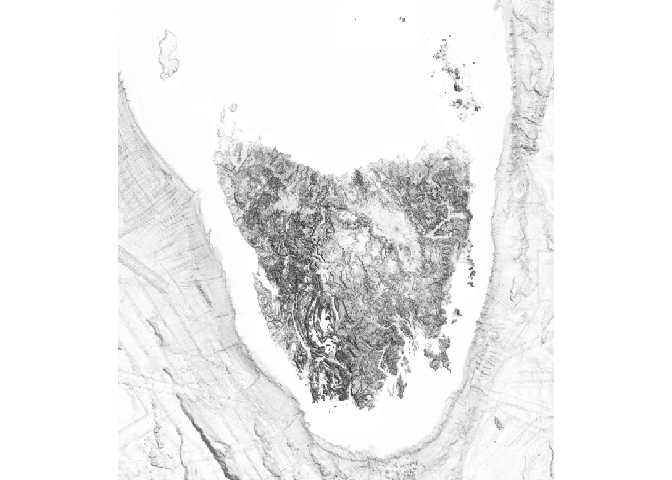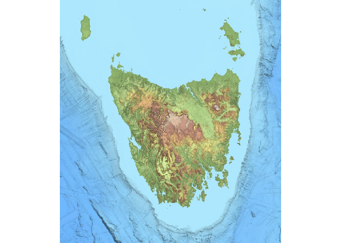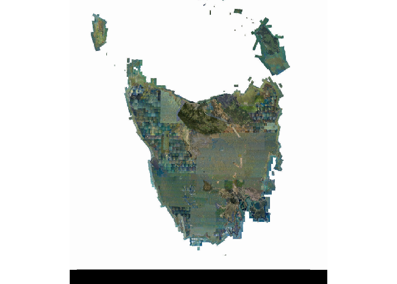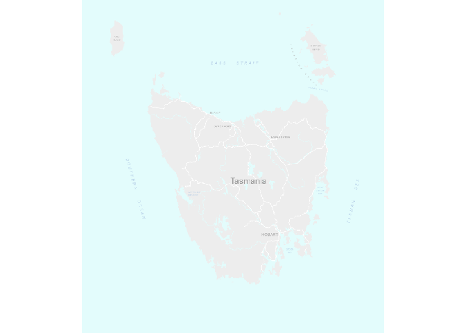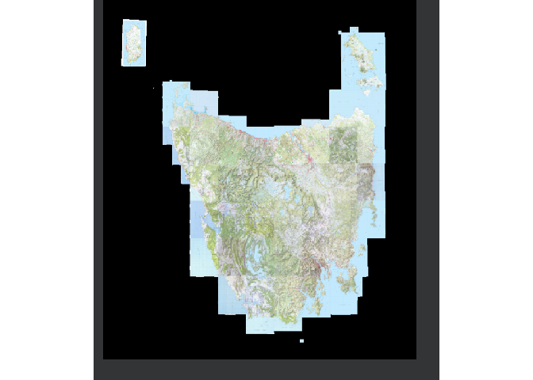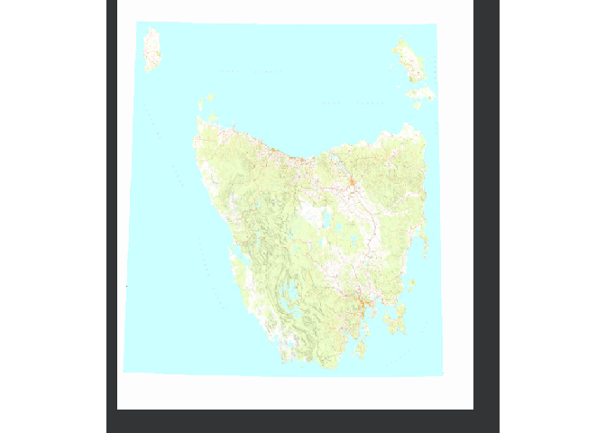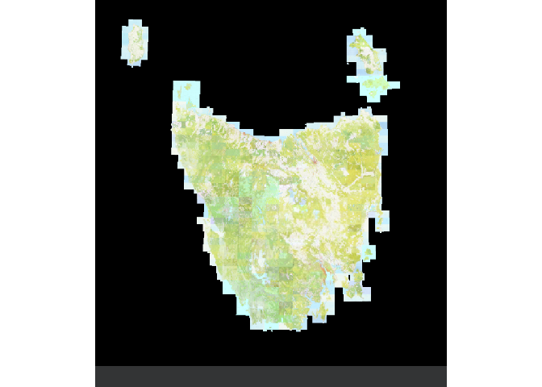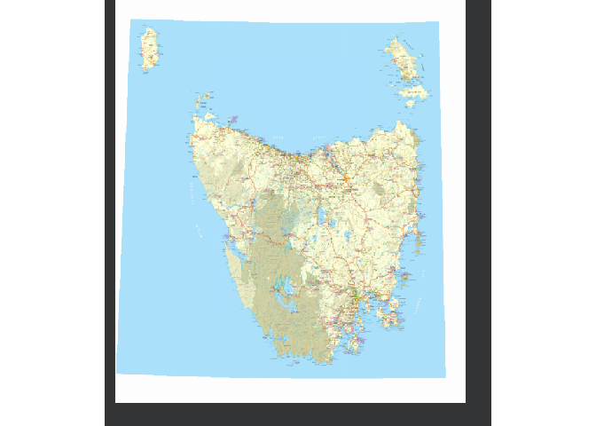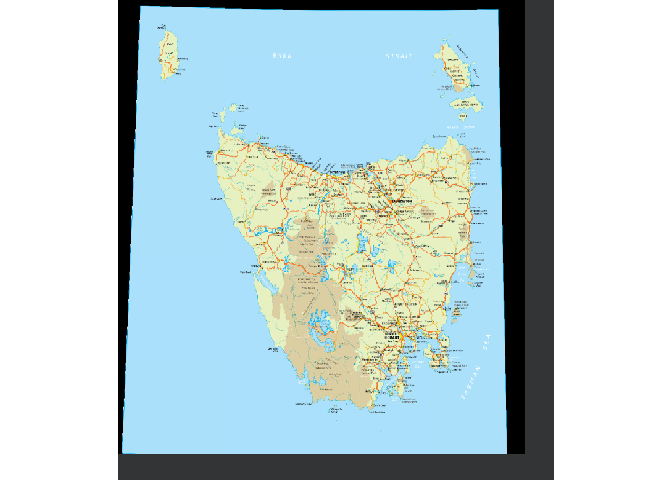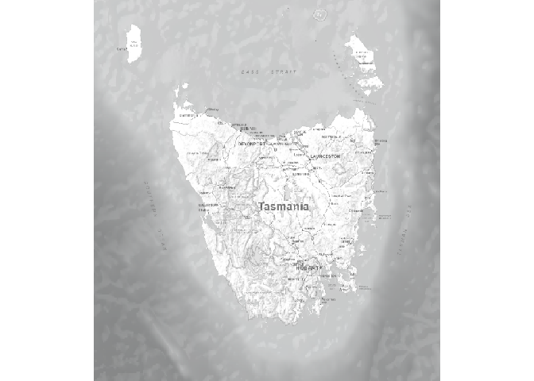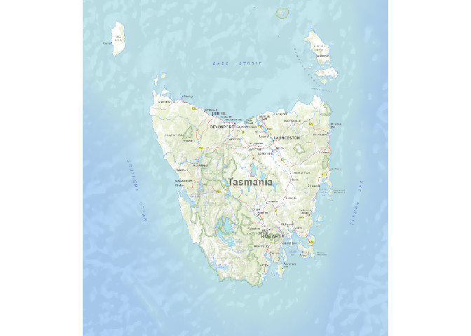

## Code of Conduct

Please note that the listmap project is released with a [Contributor
Code of
Conduct](https://contributor-covenant.org/version/2/0/CODE_OF_CONDUCT.html).
By contributing to this project, you agree to abide by its terms.
