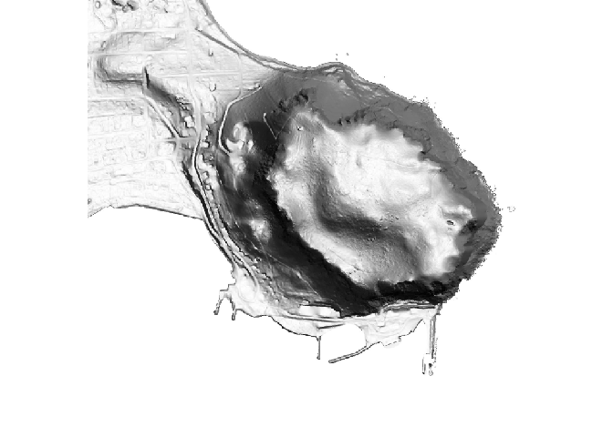

<!-- README.md is generated from README.Rmd. Please edit that file -->

# listmap

<!-- badges: start -->
<!-- badges: end -->

The goal of listmap is to get thelist imagery.

## Installation

You can install …

## Example

This is a basic example which shows you how to solve a common problem:

``` r
library(listmap)
library(raster)
#> Loading required package: sp
for (ilayer in 3:14) {
  plotRGB(listmap(layer = ilayer))
}
```


``` r
ex <- c(16173799 + c(0, 2000), -4978125 + c(-500, 1500))
r <- raster(extent(ex), nrows = 1024, ncols = 1024, crs = "EPSG:3857")
plotRGB(listmap(r, layer = 4))
```



``` r
plotRGB(listmap(r, layer = 6))
```


``` r
plotRGB(listmap(r, layer = 13))
```


``` r

print(listmap:::layers)
#>  [1] "AerialPhoto2020"      "AerialPhoto2021"      "ESgisMapBookPUBLIC"  
#>  [4] "HillshadeGrey"        "Hillshade"            "Orthophoto"          
#>  [7] "SimpleBasemap"        "Tasmap100K"           "Tasmap250K"          
#> [10] "Tasmap25K"            "Tasmap500K"           "TasmapRaster"        
#> [13] "TopographicGrayScale" "Topographic"
```

## Code of Conduct

Please note that the listmap project is released with a [Contributor
Code of
Conduct](https://contributor-covenant.org/version/2/0/CODE_OF_CONDUCT.html).
By contributing to this project, you agree to abide by its terms.
